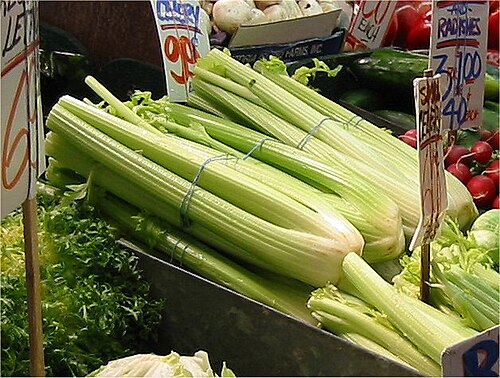
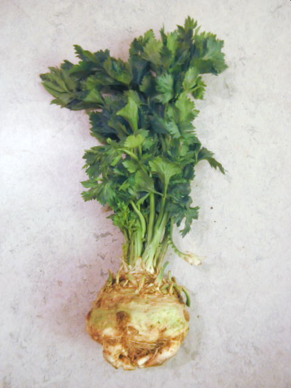
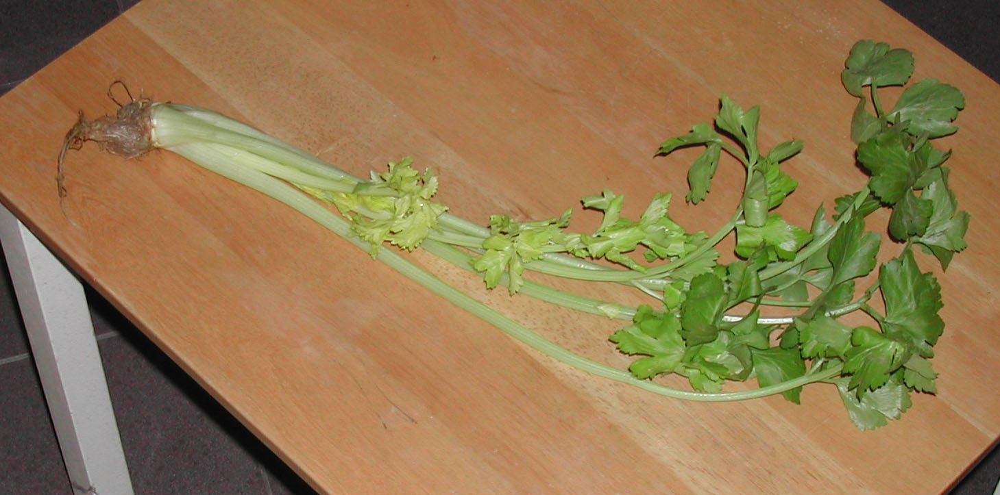

# 芹菜

芹菜约于16世纪在意大利被开发为蔬菜食用，直至现代，大概可分为3个主要栽培种[^分类依据]：

## 西芹

西芹（Celery）的食用部位一般是叶柄，可以生食（比如地中海饮食中的凉拌沙拉）或熟制（比如西芹炒虾仁）。

## 球茎芹

球茎芹（Celeriac）的食用部位是其膨大的块根，常用于煲汤或切碎后放入沙拉。

## 叶芹

叶芹（Leaf celery）整株可食用，常用于汤的调味料。潮汕香芹为其中一种，植株更小、更细，偏黄色，具有浓烈的独特香气，其被切碎后的小粒常用于潮汕地区的牛肉丸粿条汤、砂锅粥等菜式中，也用作潮汕牛肉火锅的蘸料。

[^分类依据]: https://en.wikipedia.org/wiki/Apium_graveolens#Uses