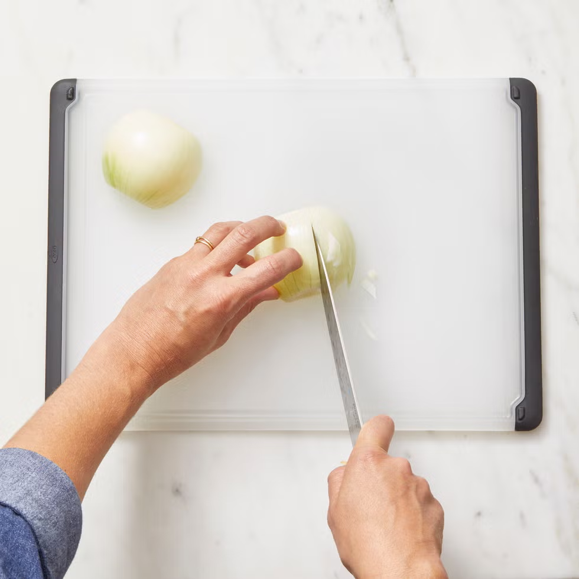
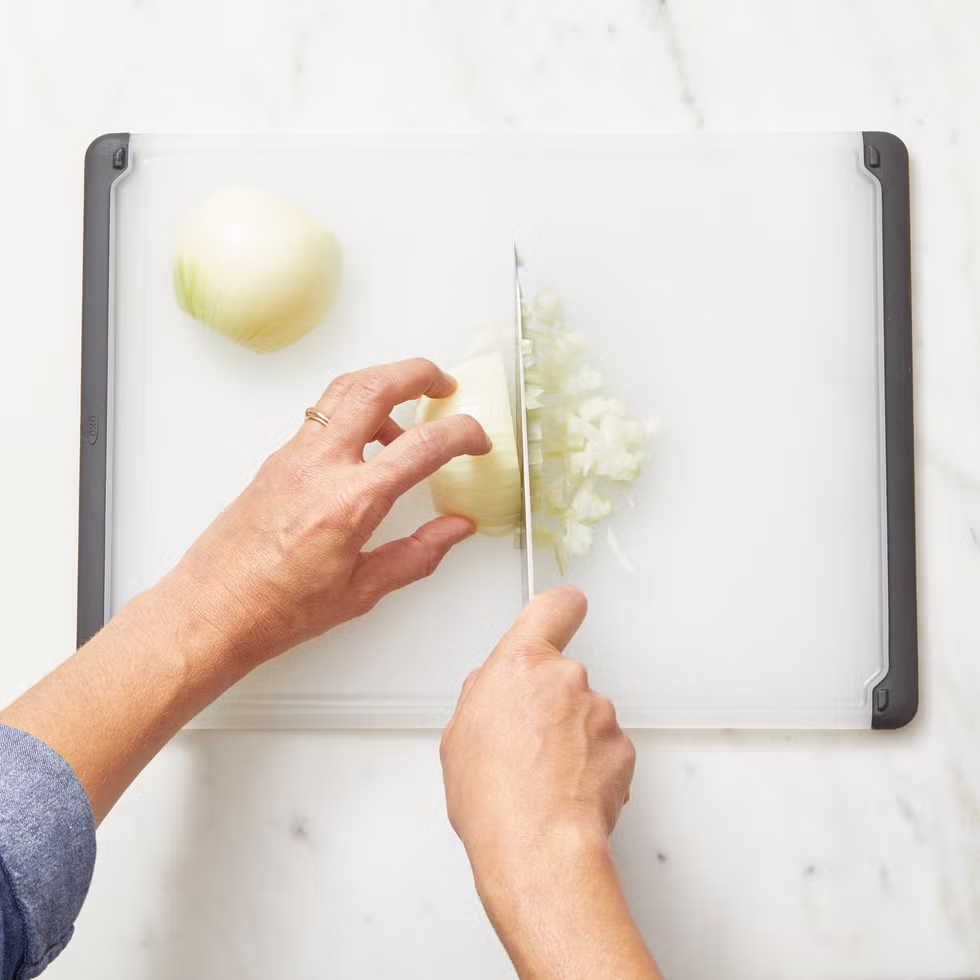

# 洋葱

## 改刀

一般来讲，由于洋葱为接近球体的形状，为安全起见，通常我们会将其从中间沿著根部的方向切成两半，再分别处理。

### 切丁

将半个洋葱切丁需要两步：

1. 截面向下，垂直切，但保留根部约 `0.5` cm 的宽度，不要完全切断 [^来源]

2. 将洋葱旋转，用手握住根部，横向切割[^来源] 

[^来源]: https://www.womenshealthmag.com/tw/food-nutrition/diet/g46351253/how-to-cut-an-onion/